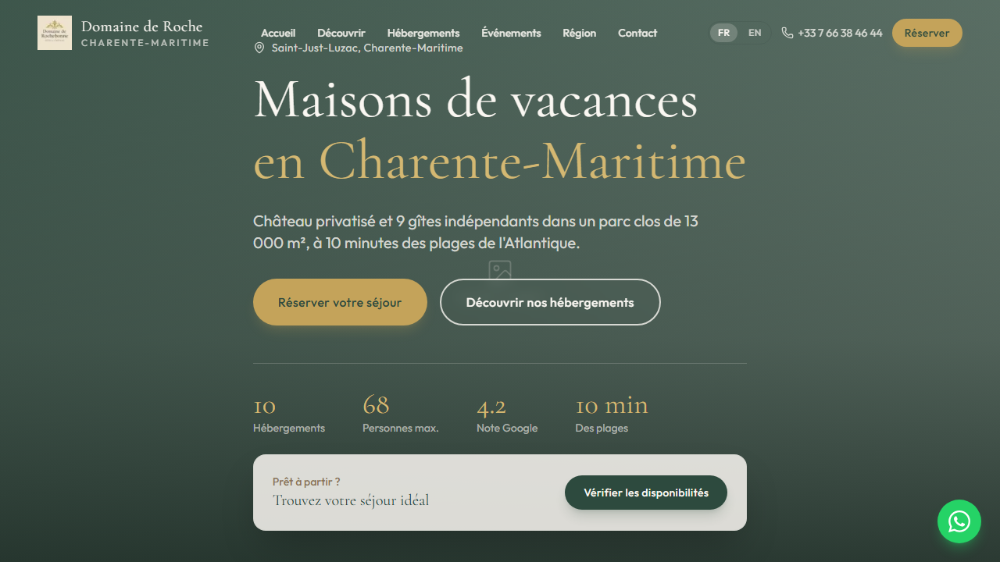

# Domaine de Roche



Site vitrine pour le **Domaine de Roche** — château et gîtes en Charente-Maritime (Saint-Just-Luzac).

| | |
|---|---|
| **URL production** | https://domainederoche.vercel.app |
| **Dépôt GitHub** | [github.com/dariohd/DomaineDeRoche](https://github.com/dariohd/DomaineDeRoche) |
| **Notes techniques** | [docs/ARCHITECTURE.md](docs/ARCHITECTURE.md) |
| **Hébergement** | Vercel |
| **Création** | [Bulle ton site](https://bulletonsite.com) — Hugo Davion |

---

## Stack technique

- **Next.js 16** (App Router) + **React 19**
- **TypeScript**
- **Tailwind CSS 4**
- **Framer Motion** (animations scroll / hero)
- **next-intl** — internationalisation FR / EN
- **lucide-react** (icônes)
- Déploiement **Vercel**

---

## Fonctionnalités

- Pages : accueil, découvrir, hébergements, événements (mariages/séminaires), région, contact
- **Multilingue** FR/EN (`messages/fr.json`, `messages/en.json`)
- Hero carousel, sections animées, témoignages
- Fiches hébergements (château + 9 gîtes)
- Bloc événements (capacité 80 personnes, parc 13 000 m²)
- **SEO** : metadata dynamique, Open Graph via `siteConfig`
- Mentions légales / confidentialité intégrées aux traductions
- Design responsive mobile-first

---

## Structure du projet

```
DomaineDeRoche/
├── src/
│   ├── app/[locale]/       # Routes i18n (layout, pages)
│   ├── components/
│   │   ├── home/           # Hero, about, accommodations preview…
│   │   └── layout/         # Header, footer
│   ├── lib/data/site.ts    # Config globale (URL, contact, réseaux)
│   └── i18n/               # Routing locales
├── messages/
│   ├── fr.json
│   └── en.json
├── public/                 # Images statiques
├── next.config.ts
├── vercel.json
└── package.json
```

---

## Prérequis

- Node.js 20+
- npm ou pnpm

---

## Développement local

```bash
npm install
npm run dev
```

→ **http://localhost:3000**

Locales : `/fr` (défaut) et `/en`.

---

## Scripts

| Commande | Description |
|----------|-------------|
| `npm run dev` | Serveur de développement |
| `npm run build` | Build production |
| `npm run start` | Serveur production local |
| `npm run lint` | ESLint (config Next.js) |

---

## Configuration

Fichier central : `src/lib/data/site.ts`

```ts
name, url, email, phone, address, social, stats
```

URL canonique : `https://domainederoche.vercel.app`

Textes éditoriaux : `messages/fr.json` et `messages/en.json`.

---

## Déploiement

1. Push sur `main` → Vercel build automatique
2. Variables d'environnement : aucune obligatoire pour le site statique/SSR de base
3. Domaine custom : ajouter dans Vercel → Domains si le client en fournit un

---

## SEO & i18n

- `generateMetadata` dans `src/app/[locale]/layout.tsx`
- `siteName`, `description`, `openGraph.url` depuis `siteConfig` + traductions
- Alternance FR/EN via middleware next-intl

---

## Conformité

- Sections légales dans les fichiers de traduction (mentions, RGPD)
- Coordonnées client : William & Johanna — Saint-Just-Luzac

---

## Contact projet

- **Client** : Domaine de Roche — Charente-Maritime
- **Email** : info@domainederochebonne.com
- **Développement** : [bulletonsite.com](https://bulletonsite.com)
